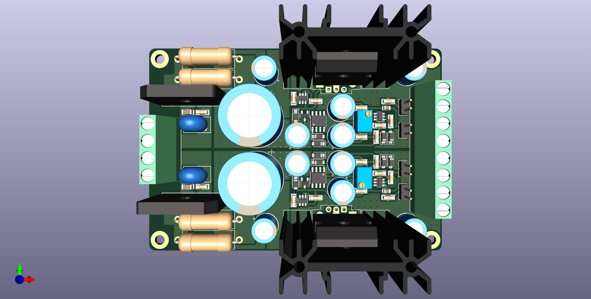

# Jung-Didden Super Regulator
High performance dual linear power supply.

## Disclaimer
This power supply is based on Walt Jung and Jan Didden's [Super Regulator](https://linearaudio.nl/superregs) design.

## Changelog
* 05/10/2023: Changed output voltage to 15V.
* 27/09/2023: Changed board to 4 layers. Removed fuses. Added MOV surge protection and resistors for RC input filter.
* 25/09/2023: Initial public upload.